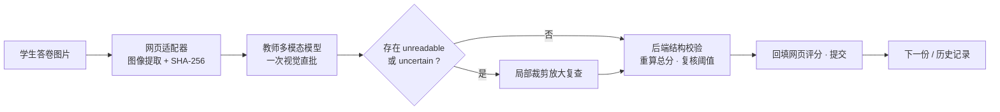
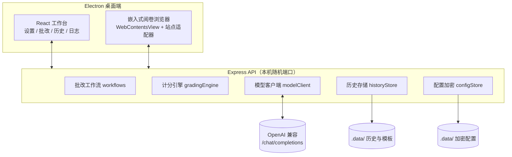

# 衡准 · EquiGrade

> 高中物理手写作答 AI 自动改卷工作台 —— 视觉教师模型直批 · 评分标准版本化 · 网页阅卷流水线


一个面向高中物理大题的**本地单机**自动改卷工作台（Windows 优先）。教师多模态模型直接查看题目、评分标准与学生答卷原图，**一次调用**同时完成"最终答案判定 + 逐评分点审验 + 教师评语"；后端只做结构校验、按当前评分标准版本**重算总分**与复核阈值判定，不信任模型返回的总分。桌面端（Electron）右侧内嵌目标阅卷网页，自动写分、提交并翻页。

## ✨ 核心特性

- **视觉直批**：题目 + 评分标准 JSON + 参考答案 + 答卷原图一次模型调用完成判分；正常答卷只调用一次模型，无需独立整卷 OCR
- **双层结构化审验**：逐小问给出 `correct / incorrect / missing / uncertain` 权威结论，逐评分点给出 `satisfied / not_satisfied / not_present / unreadable` 审验结论，并附可定位证据
- **后端重算总分**：模型总分不作为依据；判定 `correct` 的小问直接满分，过程审验仍完整执行但**不得降低**该小问得分
- **复核安全**：`unreadable` / `uncertain` / 审验冲突 → 强制转人工复核，绝不静默按普通 0 分发布；复核不提高 `maximumPossibleScore`
- **评分标准版本化**：确认后保存为本机模板，后续修改生成新版本；历史重判使用当次评分标准快照，不覆盖旧结果
- **网页阅卷流水线**：智学网 / 通用站点适配器自动提取答卷图（含 SVG→PNG 与 SHA-256）、回填分数、提交、翻页；`pageKey` / `pageToken` / `imageHash` 三重防串卷
- **本地优先与隐私**：API Key AES-256-GCM 加密、日志脱敏、数据全部存本机 `.data/`
- **稳健的模型调用**：结构化输出按 `json_schema → json_object → 纯 JSON` 降级；`finish_reason=length` 整次作废；LaTeX 走 `[[LATEX_BS]]` 安全协议
## 🧠 工作原理



流程要点：

1. 在"系统设置"配置 OpenAI 兼容 `/chat/completions` 服务、人工复核阈值与教师模型推理强度
2. 上传/粘贴题目、参考答案与评分标准；文本模型生成结构化评分规则草稿，人工检查后保存
3. 上传学生作答图片并开始批改；视觉直批把题目文字、评分标准 JSON、题目图、参考答案图与学生答卷原图放入**一次**核心模型调用
4. 模型返回逐小问判定、逐评分点审验与教师评语；若首次结果含 `unreadable` 或最终答案 `uncertain`，才额外发起一次局部裁剪放大视觉复查
5. 后端校验所有小问、评分点与证据引用，**重新计算总分**并标记整卷复核风险（默认阈值 2 分）
6. 结果回填阅卷网页并提交；历史记录支持用当次评分标准重新批改旧结果（新增版本，不覆盖）

**过程评分边界**：严格区分 `formula / substitution / result / text` 证据对象。等价判断只适用于学生卷面实际写出的表达——公式点必须有明确可见的符号关系证明，不能根据数字算式反推学生未写出的公式；代入点必须有正确关系与数据对应；结果错误不能反向证明此前步骤正确。该边界由教师模型依据原图自主判断，不使用本地字符串/公式模板匹配。

"学生答卷批改方式"默认"视觉直批（推荐）"；也可选择"先提取卷面证据，再分步评分"的三次调用兼容流程，适合暂不支持一次多模态结构化输出的服务。
## 🏗 架构



## 🧰 技术栈

| 层 | 技术 |
|---|---|
| 桌面端 | Electron 43 · React 19 · Vite 7 |
| 后端 | Express 5 · TypeScript 5.8（strict） |
| 校验/安全 | zod · AES-256-GCM · timingSafeEqual · 出站 URL 白名单 |
| 渲染 | KaTeX（确定性渲染，`[[LATEX_BS]]` 安全公式协议） |
| 测试 | Vitest（146 用例全量回归） |

## 🚀 快速开始

前置：Node.js 20+（建议 22+）

```powershell
npm install
npm run dev          # 开发（API 随机端口 + Vite 5173）
npm run electron:dev # 桌面端开发（构建 preload + 启动 Electron）
npm run package:win  # 生成 Windows x64 安装包（release\）
```

浏览器直接访问服务仅显示桌面端引导页，并保留两个测试入口：`/mock-grading`（通用 `data-grading-*` 控件测试页）与 `/zhixue-mock`（智学网专用适配器模拟页）。服务端首次启动会自动保存一份"模拟网页改卷演练 · 圆周运动"测试模板。
## 🧪 本地测试站

`/zhixue-mock` 复刻智学网真实结构：`#topicImgContent`、`.scorearea`、`#txt_marking_all`、`#bnt_save`、`a[title="上一份"]` 与 `a[title="下一份"]`。模拟页提供 JSON 测试用例导入/导出、答卷图像、最终总分保存、自动提交开关、上一份/下一份与任务量进度；为对齐真实智学网约束，**当前份未保存时"下一份"按钮禁用**，不连接真实智学网。

JSON 测试用例格式如下，`imageDataUrl` 可选；没有图片时会根据 `lines` 生成本地 SVG 答卷图：

```json
{
  "version": 1,
  "site": "zhixue-mock",
  "cases": [
    {
      "id": "student-001",
      "studentId": "学生 001",
      "label": "学生 001",
      "questionLabel": "第 16 题 · 竖直圆轨道综合题",
      "maxScore": 18,
      "lines": ["(1) mgh=1/2 mvB²，vB=8.0 m/s", "NB-mg=mvB²/R，NB=45 N", "(2) vC²=32，NC=15 N>0，能通过C点", "(3) NC=0，hmin=5R/2=2.00 m", "(4) cosθ=-5/6，θ=146.4°，v=2.58 m/s"]
    }
  ]
}
```

Electron 流水线的"测试任务"默认打开 `/zhixue-mock`，可直接验证智学网专用适配器的页面检查、图像提取、总分写入、提交确认与翻页逻辑；`/mock-grading` 入口保留用于通用适配器回归测试。适配器从 `img.currentSrc`、`src`、`srcset`、`data-src`、`data-original`、CSS `background-image` 或 `canvas` 提取作答图，计算 SHA-256 后调用 `/api/pipeline/grade`，服务端会重新计算上传图片哈希并校验；异常跳过当前答卷并记录原因，连续 3 次失败后暂停。
## 📁 项目结构

```
src/       前端。DesktopApp.tsx 桌面端主应用
server/    后端。index.ts 路由 · workflows.ts 批改工作流 · gradingEngine.ts 计分引擎
           · modelClient.ts 模型调用（降级链/信号量） · historyStore.ts · configStore.ts · schemas.ts
electron/  主进程。main.ts · browserSession.ts（嵌入式浏览器+会话持久化）
           · plugins/（runtime.ts 状态机 · zhixueAdapter.ts · genericAdapter.ts · imageExtractor.ts）
shared/    前后端共享。types.ts · electron.ts IPC 契约 · uiConstants.ts · pipelineEvents.ts
.data/     运行时数据（模板/历史/加密配置）——绝不提交
```

## ✅ 质量保障

```powershell
npx tsc -b                            # 前端 + shared 类型检查
npx tsc -p tsconfig.server.json       # server 类型检查
npx tsc -p tsconfig.electron.json     # electron 类型检查
npx vitest run                        # 146 个用例全量回归
```

## 📖 开发规范

完整约定见 [AGENTS.md](./AGENTS.md)。核心设计不变量（改代码前必读）：

- **计分权威**：教师模型判定 `correct` 的小问无条件满分，过程审验不得降低得分；总分一律由后端重算
- **复核安全**：`unreadable` / `uncertain` / 审验冲突 → 转人工复核，绝不静默按 0 分发布
- **防串卷**：`pageKey` / `pageToken` / `imageHash` 三重校验是写分/提交前的最后同步防线，不得绕过
- **共享单点维护**：主题/字体/白名单/图片上限 → `shared/uiConstants.ts`；事件文案 → `shared/pipelineEvents.ts`；IPC 契约 → `shared/electron.ts`

## 🔐 隐私与安全

- API Key 使用 AES-256-GCM 加密存于本机 `.data/`，不会返回浏览器或写入 Git
- 所有 `/api` 请求校验 `HENGZHUN_API_TOKEN`（timingSafeEqual）；外呼模型 URL 过白名单
- 日志不记录 Key 与图片 Base64，图片只记录类型、字节数与 SHA-256 摘要；模型调用细节记录在 `.data/history.json` 的 `records[].modelCalls`

## 🔌 OpenAI 兼容约定

- `POST {baseUrl}/chat/completions`，`Authorization: Bearer {apiKey}`
- 图片使用 `messages[].content[].image_url`；多模态连接测试使用标准 `128x128` RGB PNG，避免部分供应商拒绝 `1x1` 灰度透明图
- 视觉直批一次 `direct_vision_grading` 结构化响应同时返回判分与评语，图片顺序为题目、参考答案、学生答卷；存在 `unreadable`/`uncertain` 时条件性追加一次 `unreadable_local_review`
- 结构化输出按 `json_schema → json_object → 纯 JSON` 降级；HTTP 200 但不符合业务 JSON 契约同样视为失败并继续降级
- `finish_reason=length` 视为截断并整次作废；JSON 内 LaTeX 单反斜杠会被拒绝，必须走 `[[LATEX_BS]]` 协议
- 推理强度（低/中/高）作为 `reasoning_effort` 传给最终答案判定与过程审验；服务端不支持时应保持"默认"

## ❓ 常见问题

- **模型调用报 `Unexpected token: '<'`**：Base URL 缺 `/v1` 路径，请求命中网站首页 HTML；改为 `https://host/v1`
- **接入真实阅卷网站**：替换 `electron/targetPreload.ts` 中的站点适配逻辑即可，评分模板、模型调用与本地历史数据无需改动
- **没有模型密钥**：点击"载入演示批次"可直接查看完整工作流与报告界面

## 📄 许可

本项目采用 [MIT License](./LICENSE) 开源（Copyright © 2026 Hengzhun）。

> 提示：本仓库不附带任何模型服务额度；API Key、Base URL 与答卷数据均由使用者自行配置与保管。

